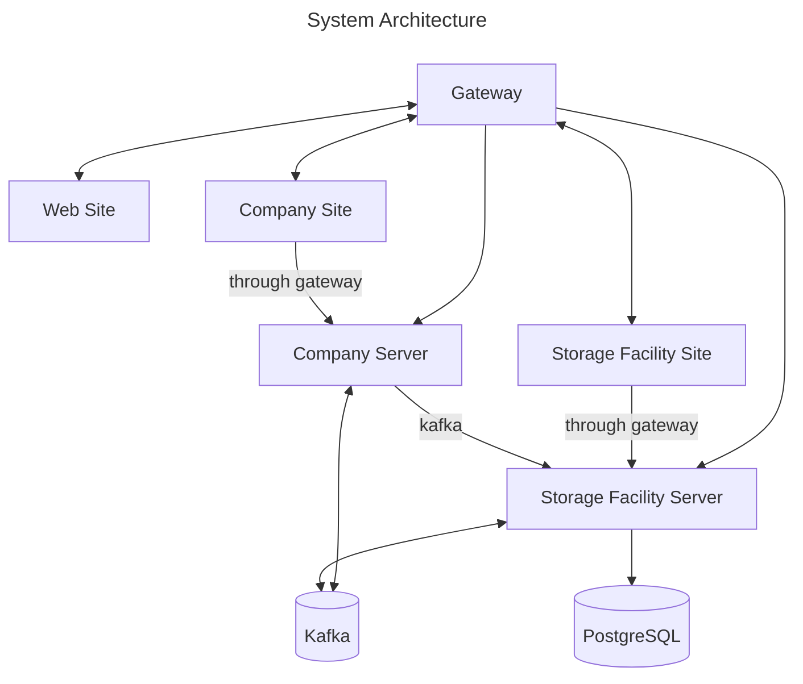

# demo-microsite

An exploration of microsite/microservice concepts.

## Overview

The purpose of this project is to explore concepts, tools, and techniques related to implementing and operating both [microservices](https://microservices.io/index.html) and [microsites](https://en.wikipedia.org/wiki/Microsite) using [Scala](https://www.scala-lang.org/) and off-the-shelf components, such as:

* [Camel](https://camel.apache.org/manual/faq/what-is-camel.html)
* [Grafana](https://grafana.com/docs/)
* [Kafka](https://kafka.apache.org/documentation/#gettingStarted)
* [PostgreSQL](https://www.postgresql.org/docs/14/index.html)
* [Prometheus](https://prometheus.io/docs/introduction/overview/)


## Quickstart

Here is how to build and run all services locally.  Note that [sbt](https://www.scala-sbt.org/) must be installed and available in order to begin.

First, clone this repository locally.

Next, build and run the unit tests from the top-level directory:

```
sbt recompile-all test
```

Then follow the instructions detailed in the [docker compose deployment](./deployment/docker/README.md) documentation.


## Roadmap

<pre>
demo-microsite
├── api
├── deployment
│   └── docker
├── documentation
│   └── adr
├── frontends
│   ├── company
│   └── site
├── gatling
├── scripts
└── services
    ├── chassis
    ├── company
    ├── inventory
    ├── purchase-order
    ├── storage-facility
    └── template.g8
</pre>





### api

This is where *all* [RAML](https://github.com/raml-org/raml-spec/blob/master/versions/raml-10/raml-10.md/) public API contracts are defined.


### deployment

Here is where deployment artifacts are defined.


### documentation

Project documentation source beyond `README`s and [Scaladoc](https://docs.scala-lang.org/style/scaladoc.html) can be found here.

This project uses [adr-tools](https://github.com/npryce/adr-tools) to manage the [ADR](https://en.wikipedia.org/wiki/Architectural_decision) definitions.


### frontends

Subprojects which provide UI/UX functionality are located here.

* see: [top-level microsite](./frontends/site/README.md)
* see: [company microsite](./frontends/company/README.md)


### gatling

This subproject defines both end-to-end "feature simulations" as well as "load test simulations."  Of note is that, while defined as a [sbt](https://www.scala-sbt.org/) `aggregate`, it does not link to *any* `frontends` or `services`.  Only the [public api](api/src/main/raml) is used.


### services

All [microservices](https://microservices.io/index.html) are located here.

* see: [company microservice](./services/company/README.md)
* see: [storage facility microservice](./services/storage-facility/README.md)


## Further Reading

*TBD*


