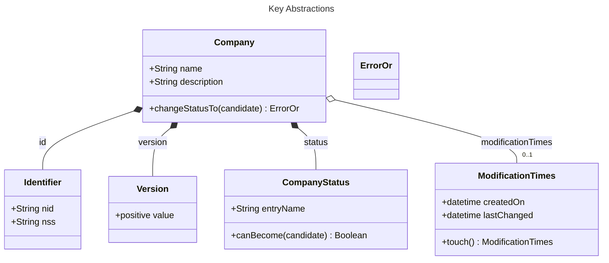
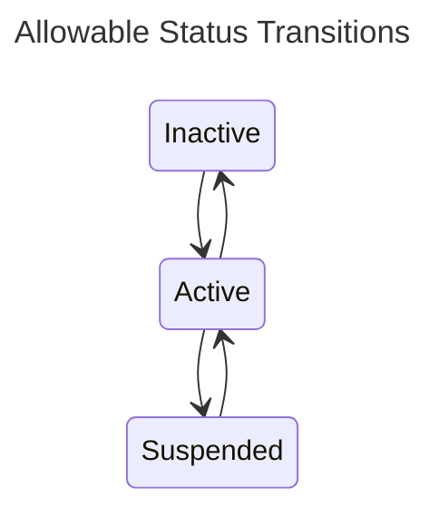

Company Microservice
====================

This sub-project defines the `copany` microservice.  Details as to how to deploy it can be found in the [deployment](../../deployment/README.md) documentation.

## Service Notes

### Kafka as a Persistent Store

The `company-service` differs from others in that it uses Kafka as its persistent store between invocations.  This is done both as an experiment to discover the implications of doing so as well as serving to cauterize dependencies.

