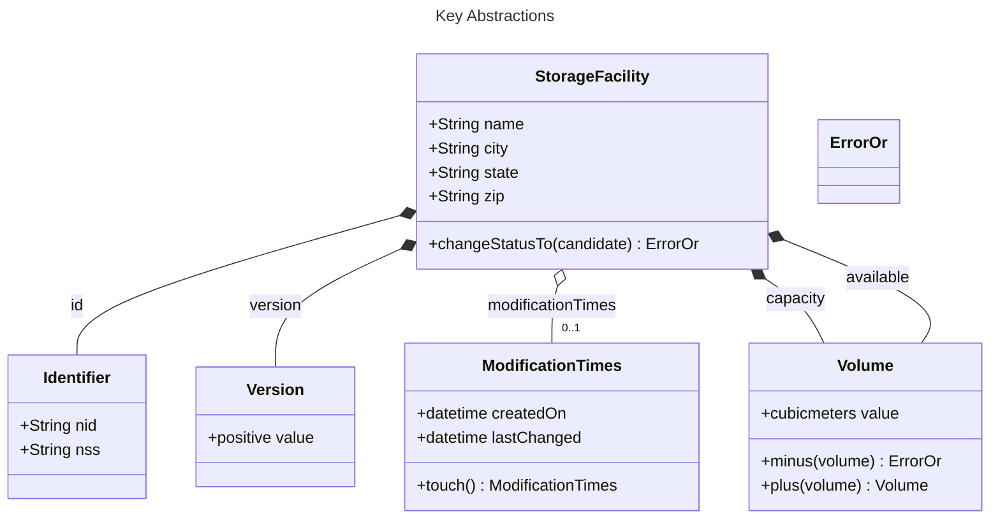
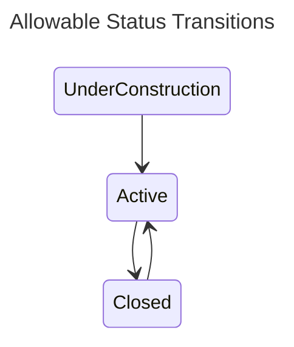

Storage Facility Microservice
=============================

This sub-project defines the `storage-facility` microservice.  Details as to how to deploy it can be found in the [deployment](../../deployment/README.md) documentation.

